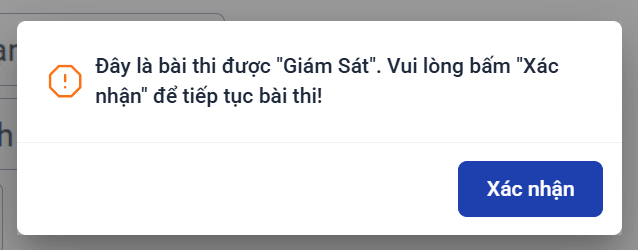
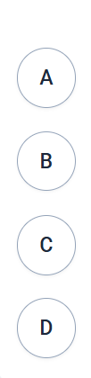
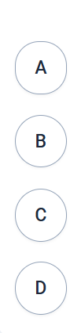

# 🤖 À Zố Tà & EL2 Helper

Extension Chrome mạnh mẽ tích hợp **Gemini 3.1 Flash Lite** hỗ trợ làm bài trắc nghiệm trực tuyến một cách nhanh chóng và chính xác. 

Được thiết kế tối ưu cho nền tảng **À Zố Tà** và **Elearning 2 VKU**.

---

## ✨ Tính năng nổi bật

- 📸 **Xử lý đa phương tiện**: Tự động phân tích câu hỏi và đáp án ở cả dạng văn bản (text) và hình ảnh.
- 🤖 **AI thông minh**: Ứng dụng mô hình ngôn ngữ lớn **Gemini 3.1 Flash Lite** siêu tốc để phân tích và tìm đáp án đúng.
- ✅ **Đánh dấu tự động (Auto-Highlight)**: Hiển thị trực quan đáp án đúng trực tiếp trên giao diện (hỗ trợ cả chế độ tối giản không hiện thông báo).
- 🔄 **Quản lý API Key thông minh**: Tự động chuyển đổi giữa các API key khi gặp lỗi giới hạn (Rate Limit) để không gián đoạn quá trình.
- ⌨️ **Phím tắt tiện lợi**: 
  - `Alt+1`: Xoá hộp thoại cảnh báo giám sát
  - `Alt+2`: Tạm dừng hoạt động của extension
  - `Alt+3`: Tiếp tục hoạt động

---

## 🚀 Hướng dẫn cài đặt

### 1. Tải mã nguồn
```bash
git clone https://github.com/vuongngan-se/azota-helper.git
cd azota-helper
```

### 2. Cấu hình API Key
1. Tạo file cấu hình từ template có sẵn:
   - Trên Windows: `copy api-keys.txt.example api-keys.txt`
   - Trên Mac/Linux: `cp api-keys.txt.example api-keys.txt`
2. Lấy API key miễn phí tại [Google AI Studio](https://aistudio.google.com/api-keys).
3. Mở file `api-keys.txt` và dán các API key vào (mỗi key nằm trên một dòng riêng biệt).

### 3. Cài đặt vào trình duyệt
1. Mở trình duyệt Chrome/Edge/Brave, truy cập trang quản lý tiện ích: `chrome://extensions/`
2. Bật chế độ dành cho nhà phát triển (**Developer mode**) ở góc phải.
3. Nhấn nút **Load unpacked** (Tải tiện ích đã giải nén) và chọn thư mục `azota-helper` vừa tải về.
4. Extension đã sẵn sàng hoạt động!

---

## 📖 Hướng dẫn sử dụng

### Trên nền tảng À Zố Tà
1. Truy cập vào bài thi/kiểm tra.
2. Click chọn một đáp án bất kỳ của câu hỏi bạn muốn phân tích.
3. Đợi từ `5-10 giây` để AI xử lý nội dung.
4. Extension sẽ tự động phát hiện và đánh dấu đáp án đúng nhất.

### Trên nền tảng Elearning 2 VKU
1. Mở popup của extension (click vào icon extension trên thanh công cụ).
2. Chuyển đổi sang **chế độ EL2 Mode**.
3. Thao tác tương tự: Click vào đáp án và chờ kết quả.

---

## 🎨 Cách nhận biết đáp án đúng

| Chế độ thông báo | Cách hiển thị |
| :--- | :--- |
| **TẮT (Chế độ tối giản mặc định)** | Chỉ cần **hover (di chuột)** vào các đáp án. Nút radio của đáp án đúng sẽ có **ruột lõi màu xám**. |
| **BẬT (Hiển thị nổi bật)** | Đáp án đúng sẽ được đóng khung với **viền màu xanh lá cây** dễ thấy. |

---

## 🖼️ Hình ảnh minh họa

**Xóa hộp thoại giám sát (Phím tắt `Alt+1`)**


**Trước và sau khi AI phân tích**
 

---

## 📁 Cấu trúc thư mục

```text
azota-helper/
├── manifest.json          # File cấu hình chính của Chrome Extension
├── content.js             # Script nhúng trực tiếp vào trang web để xử lý DOM
├── background.js          # Background service (Service Worker)
├── popup.html/js          # Giao diện người dùng của extension
├── gemini-api.js          # Module giao tiếp với Google Gemini API
├── api-key-manager.js     # Module quản lý và xoay vòng API Keys
├── styles.css             # Tuỳ chỉnh hiển thị
└── api-keys.txt.example   # File mẫu để thiết lập API key
```

---

## ⚠️ Lưu ý quan trọng
- Yêu cầu **kết nối Internet** ổn định để gửi yêu cầu đến Gemini API.
- API keys được lưu trữ **an toàn 100%** ngay trên thiết bị của bạn, không gửi qua bất kỳ server trung gian nào khác ngoài Google.
- Nếu gặp lỗi `503 Service Unavailable` hoặc `Request Timeout`, hãy click lại vào đáp án một lần nữa và kiên nhẫn chờ 5-10 giây. Tránh click liên tục gây lỗi spam.
- Công cụ sinh ra với mục đích **hỗ trợ học tập**, vui lòng sử dụng có trách nhiệm.